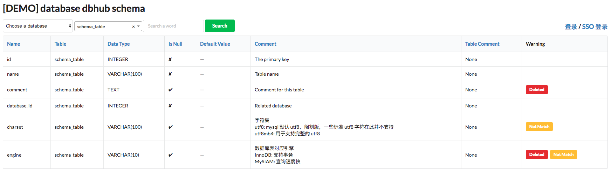

# DBHub

DBHub is a free database schema automatic discovery and easily commenting tool. 
DBHub now can support mysql, mongodb and other 6 databases, it is easy to extend.
DBHub has a web page for viewing all schema with comments and has an admin system for managing.

[](https://travis-ci.org/huifenqi/dbhub)



## Structure:

* apps (web and admin page)
* scripts (sync and check)
* configs (supervisor, newrelic and uwsgi)

## Installation

To set up a development environment quickly, install Python 2.x first. It
comes with virtualenv built-in. so create a virtual environment with:

`virtualenv -p python2 env`

Install dependencies:

`pip install -r requirements.txt`

## Run server

`python manage.py runserver --settings=dbhub.settings.dev`

## Add database

* name: database name
* config: whole url for connect with database
* for MySQL: mysql://{username}:{password}@{database-url}:3306/{database-name}?charset=utf8
* for SQLite: sqlite:////{absolute-path-to-db-file}
* for MongoDB: mongodb://{username}:{password}@{database-url}:27017/{database-name}

## Sync databases' schema and check columns' enumeration

`python manage.py runscript sync`

`python manage.py runscript check --script--args [db_name] [table_name] `

## How to write comments with enumeration

1. write description first;
2. write enumerations below with {enum}: {description}.

```
charset with description, blah, blah, blah

utf8: A UTF-8 encoding of the Unicode character set using one to three bytes per character. default utf8 of mysql, max length is 3 bytes, not support characters, such as emoji.

utf8mb4: A UTF-8 encoding of the Unicode character set using one to four bytes per character.

```

## Supported dialects

* Firebird
* Microsoft SQL Server
* MySQL
* Oracle
* PostgreSQL
* SQLite
* Sybase
